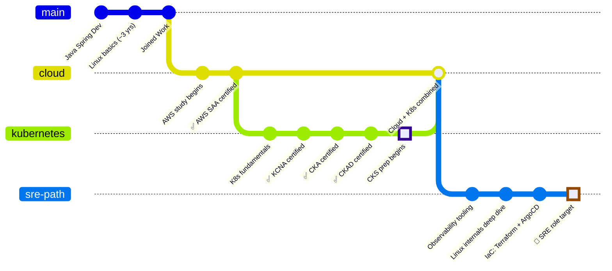
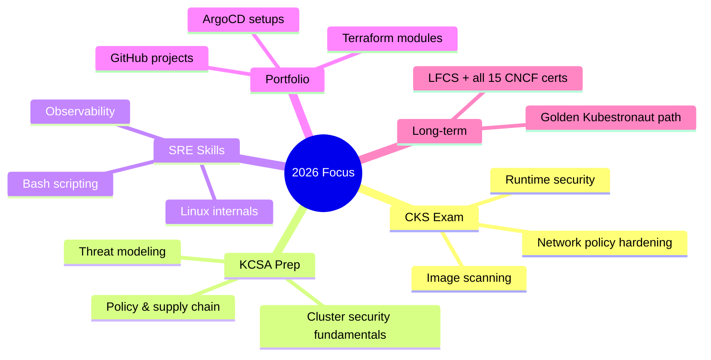
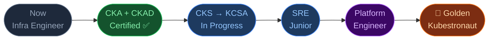

<div align="center">

```
██╗  ██╗██╗   ██╗███╗   ██╗████████╗███████╗██╗   ██╗██╗  ██╗███████╗
██║ ██╔╝██║   ██║████╗  ██║╚══██╔══╝██╔════╝██║   ██║██║ ██╔╝██╔════╝
█████╔╝ ██║   ██║██╔██╗ ██║   ██║   ███████╗██║   ██║█████╔╝ █████╗
██╔═██╗ ██║   ██║██║╚██╗██║   ██║   ╚════██║██║   ██║██╔═██╗ ██╔══╝
██║  ██╗╚██████╔╝██║ ╚████║   ██║   ███████║╚██████╔╝██║  ██╗███████╗
╚═╝  ╚═╝ ╚═════╝ ╚═╝  ╚═══╝   ╚═╝   ╚══════╝ ╚═════╝ ╚═╝  ╚═╝╚══════╝
```

**Infrastructure & Platform Engineer in Progress**
`Japan` · `Work` · `SRE路線`

[](https://aws.amazon.com/certification/)
[](https://www.cncf.io/certification/kcna/)
[]()
[]()
[]()
[]()

</div>

<div align="center">


</div>

---

## `$ whoami`

```yaml
name: KunTsuKe
location: Japan 🇯🇵
role: Infrastructure / Server Engineer
target: SRE → Platform Engineer
background: Java Spring → Linux → Cloud → Kubernetes
languages: Myanmar . Japanese · English
```

---

## Career Git Log



---

## Certification Timeline

```
2024                    2025                2026                  2026 →
─────────────────────────────────────────────────────────────────────────►

   t1               t2              t3            t4           t5
    │                 │               │             │            │
────┼─────────────────┼───────────────┼─────────────┼────────────┼──────
    │                 │               │             │            │
 [AWS SAA ✅]          [KCNA ✅]          [CKA ✅]    [CKAD ✅]    [CKS 🔥]
    │                 │               │             │            │
 Solutions         Kubernetes      Kubernetes    Kubernetes    Kubernetes
 Architect         & Cloud         Admin         App Dev       Security
 Associate         Native Assoc.   (certified)   (certified)   (preparing)

                                                            → KCSA → Golden
                                                              Kubestronaut
                                                              (long-term)
```

---

## Tech Stack

```
  Infrastructure & Cloud
  ──────────────────────────────────────────────────────
  AWS          ████████████████░░░░  80%   (SAA certified)
  Kubernetes   █████████████████░░░  85%   (CKA + CKAD certified)
  Docker       ███████████████░░░░░  75%
  Linux        █████████████░░░░░░░  65%   (deepening)
  Terraform    ████████░░░░░░░░░░░░  40%   (building)
  ArgoCD       █████░░░░░░░░░░░░░░░  25%   (learning)

  Languages & Scripting
  ──────────────────────────────────────────────────────
  Java Spring  ████████████████░░░░  80%   (background)
  Bash         █████████████░░░░░░░  65%
  Python       ███████░░░░░░░░░░░░░  35%   (growing)
  YAML/HCL     ██████████████░░░░░░  70%

  Observability (target zone)
  ──────────────────────────────────────────────────────
  Prometheus   █████░░░░░░░░░░░░░░░  25%
  Grafana      █████░░░░░░░░░░░░░░░  25%
  ELK Stack    ███░░░░░░░░░░░░░░░░░  15%
```

---

## Current Focus



---

## How I Work

```
  Daily workflow:
  ───────────────────────────────────────────────────────────

  [Work]                   [Study: After hours]
       │                              │
       ├─ Java                       ├─ Hands-on labs
       ├─ Spring Batch               ├─ CKS/KCSA prep
       ├─ PostgresDB                 ├─ Note-taking (GitHub)
       └─ AWS Aurora                 └─ Cert prep

  Learning style: scenario-based › read-heavy
  Note style:     diagrams + timelines > dense prose
```

---

## What I'm Building Toward



---

## Notes & Resources I Write

> I document everything I learn — for future me and anyone else on the same path.
> This includes the messy parts: gaps I'm still closing, mistakes I caught and fixed, not just the finished certs.

```
📁 Obsidian_Notes_20260614/    (github.com/Kuntsuke-hash/Obsidian_Notes_20260614)
   └── ... study notes, runbooks, cert prep logs

📁 99_RepoSandBox/
   ├── about.html
   ├── contact.html
   ├── index.html
   ├── nt_con_op.md
   ├── nt_conflict_01.md
   ├── product.html
   ├── rebase,vert,reset.md
   ├── search.html
   ├── user.html
   └── MyProfile/
        └── README.md
```

---

<div align="center">

```
"Automate the boring. Observe the rest. Fix it before it breaks."
```

`SRE in progress` · `Japan` · `Open to connect`

</div>
